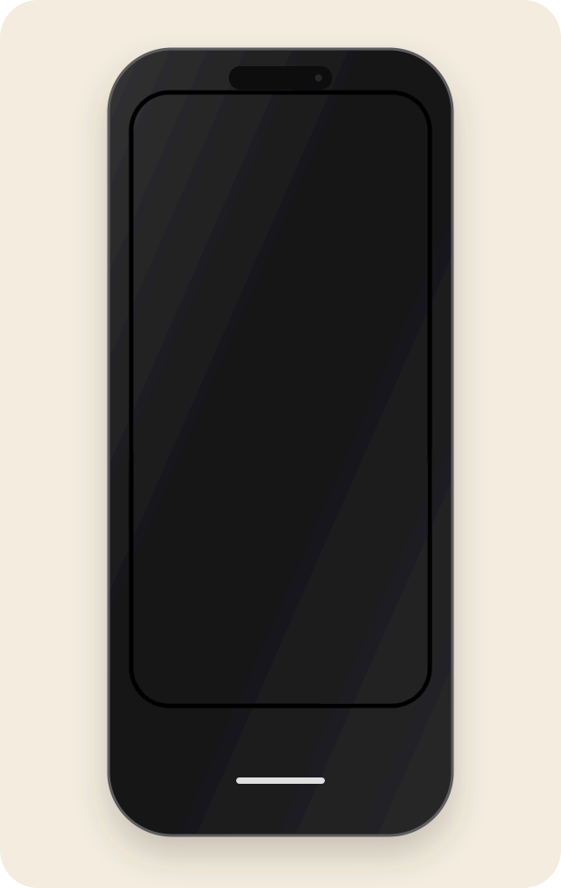

# Restaurant Casa Rusu · Codlea

Sito Astro indipendente per Restaurant Casa Rusu. Testi, contatti, colori e collegamenti sono in `src/data/site.ts`; logo, fotografie e font sono locali in `public/brand/`, `public/images/` e `public/fonts/`. I font DM Sans e Cormorant Garamond sono ospitati localmente; le licenze sono in `public/fonts/OFL.txt` e `public/fonts/Cormorant-Garamond-OFL.txt`.

## Anteprima

Redesign editoriale con titoli Cormorant Garamond, palette avorio e bronzo derivata dal logo, fotografie reali e prenotazione telefonica nella navigazione. Layout responsive, tema scuro secondo le preferenze di sistema e rispetto di `prefers-reduced-motion`.

Homepage catturata in locale nelle versioni desktop e mobile, presentata in mockup MacBook e iPhone.

<p align="center">
  
</p>

<p align="center">
  
</p>

## Avvio

```bash
npm install
npm run dev
```

Per verificare o creare la versione statica:

```bash
npm run check
npm run build
```

Indirizzo, CAP, telefono e orari sono stati verificati sulla [pagina Facebook ufficiale](https://www.facebook.com/people/Restaurant-Casa-Rusu/61594316175166/) il 30 settembre 2026; il monogramma è coerente anche con il [profilo Instagram](https://www.instagram.com/restaurant.casarusu/). Gli orari pubblicati sono lunedì–venerdì 11:00–22:30 e sabato–domenica 11:00–23:00. Prima della pubblicazione definitiva, verificare che il ristorante approvi i materiali e i testi.

Per abilitare canonical assoluti, hreflang, immagini Open Graph assolute e `sitemap.xml`, impostare l'origine pubblica HTTPS in `src/config/site.ts` (`seo.siteUrl`). Finché il dominio non è configurato, il sito evita di generare URL assoluti non verificati; la sitemap non viene prodotta.

## Verifica del redesign

`npm run build` completa il controllo Astro e genera le pagine `/` e `/en/`. Verifica nel browser Paseo a 320, 390, 768, 1024 e 1440 px: nessuno scorrimento orizzontale, immagini e font locali caricati, CTA visibile e ancore valide. Menu mobile verificato in apertura e chiusura con Escape e ritorno del focus al pulsante. Le regole del tema scuro sono state applicate temporaneamente nel browser per controllare resa e contrasto.
